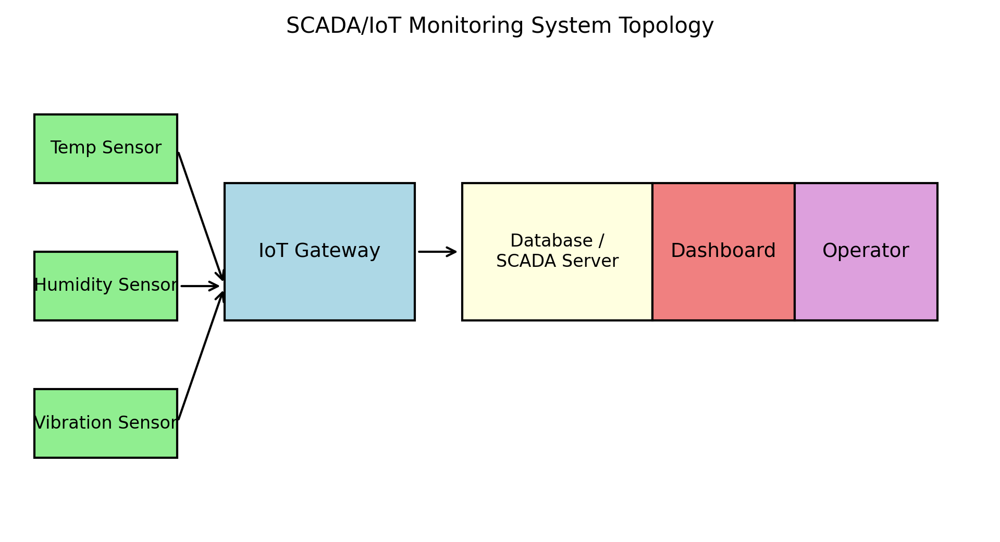

# SCADA/IoT Monitoring System

## Description

This project demonstrates how to build a **remote monitoring system** that collects data from environmental and mechanical sensors and delivers it to operators through a dashboard.  The system uses a small **IoT gateway** (such as a Raspberry Pi or ESP32) to acquire sensor readings for **temperature, humidity and vibration**, transfers the data to a **SCADA/IoT platform**, stores it in a time‑series database and visualises it with a dashboard.  By integrating sensors into a SCADA system, operators gain **real‑time performance monitoring, historical data analysis and centralized control**【624404881786730†L75-L82】, enabling them to detect anomalies, predict maintenance needs and optimise the process.

### Why SCADA/IoT?

SCADA (Supervisory Control and Data Acquisition) systems provide remote monitoring and control for industrial plants.  They gather data from devices (inverters, meters, sensors, etc.), visualise it on a central interface and offer **real‑time monitoring, event/failure recording, remote access and historical analysis**【624404881786730†L75-L82】.  Modern IoT dashboards serve a similar role: they **transform, display and organise data from network‑connected devices** so it can be read at a glance and analysed over time【128370494818392†L123-L131】.  Integrating IoT sensors with PLC controls and SCADA dashboards allows manufacturers to **monitor critical parameters in real time, optimise production and meet regulatory requirements with minimal manual intervention**【817530033999772†L123-L131】.

## Topology

The diagram below illustrates the overall architecture.  Multiple sensors connect to an IoT gateway that forwards readings to a SCADA/IoT server.  The server stores data and feeds it to a dashboard where operators can monitor trends and alarms.



## Prerequisites

- **Sensors**: A temperature/humidity sensor (e.g. DHT22) and a vibration sensor (e.g. accelerometer).  These supply analogue or digital measurements.
- **IoT Gateway**: A microcontroller or mini PC (ESP32, Arduino, Raspberry Pi) with network connectivity to read sensors and publish data via MQTT or HTTP.
- **Software Stack**:
  - **Node‑RED** for flow‑based programming to subscribe to sensor data, process it and route it to storage.
  - **InfluxDB** (or another time‑series database) to store the sensor measurements.
  - **Grafana** (or another SCADA/IoT dashboard) to visualise data and configure alerts.
- **Development Environment**: Docker or local installations of Node‑RED, InfluxDB and Grafana, or a cloud IoT platform (e.g. Thingsboard, Kaa IoT) that provides these components.

## Steps

### 1. Sensor setup and data acquisition

1. **Connect sensors to the IoT gateway.**  Wire the temperature/humidity sensor and vibration sensor to appropriate GPIO pins (or I²C/SPI interface).  Program the gateway (using Arduino or Python) to read sensor values at regular intervals.
2. **Publish readings via MQTT or HTTP.**  Use an MQTT client library to publish JSON messages with fields such as `temperature`, `humidity` and `vibration` to a broker topic (e.g. `sensors/environment`).  Include timestamps so the data can be stored chronologically.
3. **Subscribe in Node‑RED.**  In Node‑RED, add an **MQTT in** node subscribed to the sensor topic.  Use **function** nodes to parse JSON, validate readings and convert raw values to engineering units.

### 2. Data processing and storage

1. **Filter and transform data.**  Use Node‑RED functions to smooth noisy readings (e.g. moving average) or detect spikes.  Normalise values (e.g. convert accelerometer counts to g‑force) so they can be compared.
2. **Write to InfluxDB.**  Configure an **InfluxDB out** node to write measurements to a bucket (database).  Each measurement should include tags (e.g. sensor name) and fields (e.g. temperature, humidity, vibration) along with timestamps.
3. **Create retention policies and downsampling.**  InfluxDB can downsample data for long‑term storage.  Configure retention to keep raw data for a defined period and aggregated averages for longer durations.

### 3. Visualisation with a dashboard

1. **Connect Grafana to InfluxDB.**  In Grafana, add an InfluxDB data source pointing to your database.  Create a dashboard and panels for each parameter.
2. **Build charts and gauges.**  Use line charts to plot temperature, humidity and vibration over time.  Add gauge panels to show current values and define thresholds (e.g. high vibration).  According to SparkFun’s guide, an IoT dashboard **transforms, displays and organises data** so operators can monitor historical and real‑time data at a glance【128370494818392†L123-L131】.
3. **Configure alerts.**  Set alert rules in Grafana to trigger notifications (email, Slack, etc.) when values exceed acceptable limits (e.g. temperature > 30°C or vibration above a threshold).  SCADA systems support **alarm thresholds and remote management**【624404881786730†L71-L83】.

### 4. Decision support

Real‑time and historical data empower operators to make informed decisions:

- **Predictive maintenance:** Vibration sensors integrated with PLC/SCADA enable detection of equipment wear.  When combined with dashboards and alerts, maintenance can be scheduled before a failure occurs【817530033999772†L123-L131】.
- **Process optimisation:** Continuous monitoring of temperature and humidity helps maintain product quality and energy efficiency.  IoT sensors integrated with SCADA can **optimise production and meet regulatory requirements**【817530033999772†L123-L131】.
- **Event analysis:** Historical data stored in InfluxDB allows post‑incident analysis, helping engineers identify root causes and improve system design.

## Next Steps

- **Add more sensors**, such as pressure or power consumption, to expand the monitoring scope.
- **Edge intelligence:** Implement local processing on the gateway (e.g. threshold detection) to reduce network traffic and enable faster responses.
- **Cloud deployment:** Replace self‑hosted components with cloud services (e.g. AWS IoT, Azure IoT Hub, Thingsboard).  Many IoT platforms provide drag‑and‑drop dashboards and device management.
- **Security:** Secure MQTT communication with TLS and implement authentication.  Ensure that the SCADA server and Grafana are protected by firewalls and strong user credentials.

## Advanced Features

### Grafana Alert Rule Example

You can configure threshold‑based alerts to notify operators when readings leave the safe range.  In Grafana 8+:

1. **Select a panel** (e.g. the temperature chart) and click the **Alert** tab.
2. Click **Create Alert** or **Add a new rule**.
3. Configure the rule:
   - **Name:** `Temperature_Alert`.
   - **Condition:** `avg() of A` IS ABOVE `28` for `5m`.  This expression triggers if the average temperature over the past five minutes exceeds 28 °C.
   - **Evaluation interval:** `1m`.
4. Add **notifications** (email, Slack, etc.) by creating a contact point in the Alerting section.
5. Save the alert rule.  Grafana will now evaluate the condition and send alerts when thresholds are breached.

### Node‑RED JSON Schema Validation

To ensure that only valid sensor messages are processed, you can add a **JSON schema validation** step.  Use a `function` node (or the **node-red-contrib-ajv** node) with a schema definition:

```javascript
// Simple JSON schema for sensor readings
const schema = {
  type: "object",
  required: ["value", "unit"],
  properties: {
    value: { type: "number" },
    unit: { type: "string" }
  },
  additionalProperties: false
};

const Ajv = require('ajv');
const ajv = new Ajv();
const validate = ajv.compile(schema);

try {
  const data = (typeof msg.payload === 'string') ? JSON.parse(msg.payload) : msg.payload;
  if (!validate(data)) {
    node.warn('Invalid payload: ' + JSON.stringify(validate.errors));
    return null; // drop invalid message
  }
  // attach validated data to msg
  msg.value = data.value;
  msg.unit = data.unit;
  return msg;
} catch (err) {
  node.error('Payload parsing error: ' + err.message);
  return null;
}
```

This script verifies that each message contains numeric `value` and string `unit` properties.  Messages failing validation are logged and discarded.  You can extend the schema to enforce ranges (e.g. minimum/maximum temperature) or additional fields.